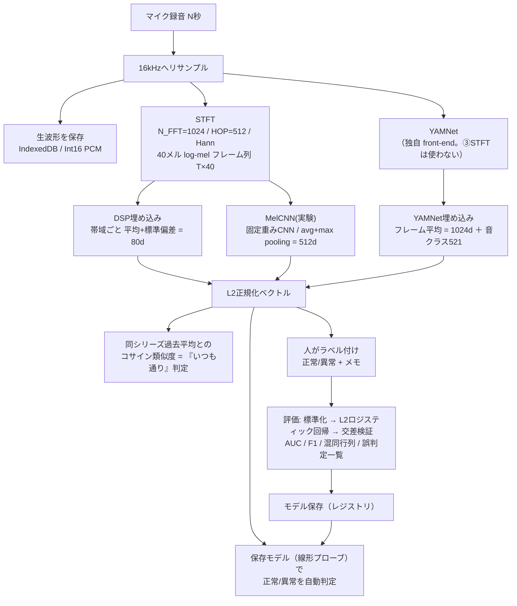
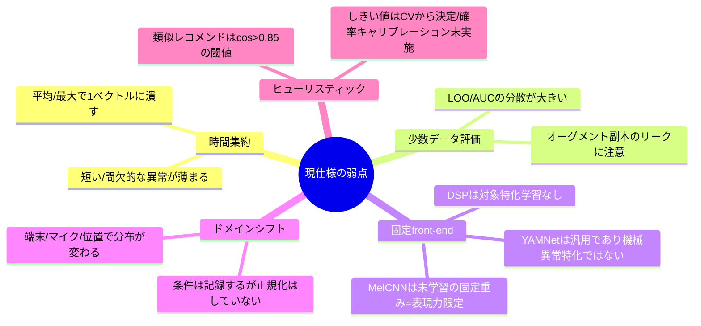
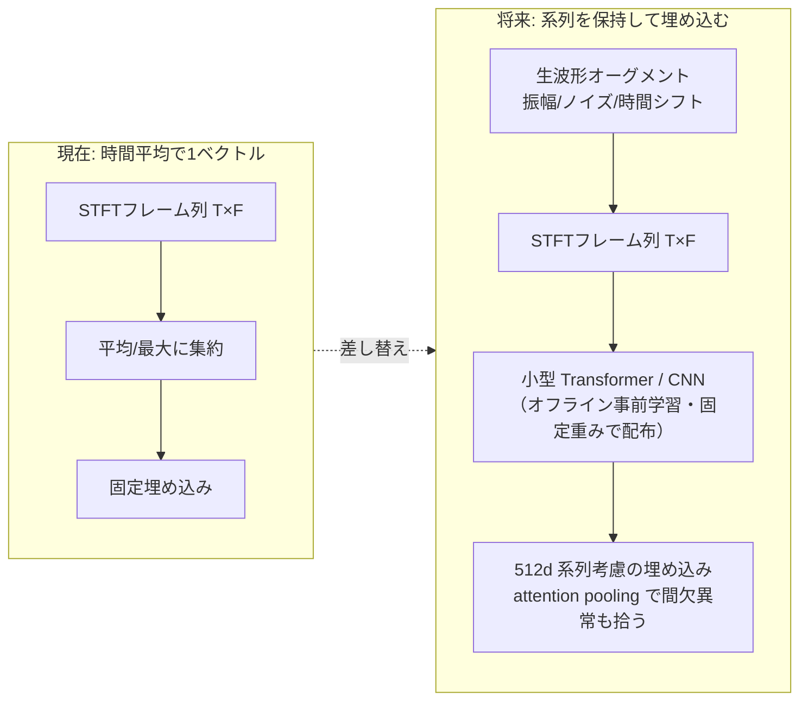
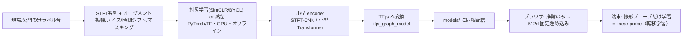

# OtoScope 設計ノート（思想・パイプライン・弱点・ロードマップ）

> 対象バージョン: v0.0.5 時点。実装の実体は `app.js`。

## 1. 設計思想

- **ローカル完結 / セキュア**: 音声・埋め込み・ラベル・モデルはすべて端末内（IndexedDB / localStorage）。実行時の外部通信はゼロ。
- **human-in-the-loop の観測ノート**: 「作り込んだ異常検知AI」ではなく、**埋め込んで・並べて・人が解釈し・ラベルで育てる**状態監視ツール。
- **凍結埋め込み + 線形プローブ**: 重い表現学習は端末でやらない。事前学習済み（または固定重み）の埋め込みで特徴を凍結し、端末では軽い**ロジスティック回帰**だけを学習する。少数データでも過学習しにくく、交差検証が現実的に回る。
- **複数の埋め込み空間を併記**: 意味的（YAMNet）と物理的（DSP）は捉える情報が違う。片方に依存せず比較する。
- **条件を明示して比較を安定化**: デバイス・マイク・場所・対象・位置関係をメタデータとして記録し、同条件での比較を促す。

## 2. 現行パイプライン

### 埋め込み3空間の性質

| 空間 | 入力 | 集約 | 次元 | 主に捉えるもの |
|---|---|---|---|---|
| YAMNet | 生波形 | フレーム埋め込みの**時間平均** | 1024 | 意味的な音色（AudioSet由来） |
| DSP | log-mel frames | 帯域ごと**平均＋標準偏差** | 80 | 物理的なスペクトル形状と変動 |
| MelCNN(実験) | log-mel 画像 | 固定重みCNN → **avg＋max** | 512 | 非線形なテクスチャ（※未学習の固定重み） |

判定は全空間 **L2正規化 → コサイン類似度／線形プローブ**。「いつも通り」の基準は**音の大きさではなく**、同シリーズ過去平均との**音色・スペクトル形状の近さ**。

## 3. 現仕様の弱点（既知の限界）

要約すると、**(1) 時間平均で間欠異常に弱い**、**(2) 少数サンプルでの評価が本質的に不安定**、**(3) 埋め込みが対象特化で学習されていない**、**(4) デバイス/位置差のドメインシフト**、が主要課題。

## 4. ロードマップ（将来の方向性）

### 小型Transformerは現実的か（検討メモ）

- **推論をブラウザで**: TF.js で可能。**現実的**。ただし**学習はオフライン（GPU）で事前に**行い、YAMNet/MelCNN と同じく**固定重みとして同梱配信**する前提。ブラウザ内でTransformer本体を数サンプルから学習するのは**非現実的**（過学習・計算量）。
- **「1測定で多数のSTFTフレーム＝サンプル増」**: 発想は正しい。1測定は多数フレームの**系列**なので、系列モデル（Transformer/1D-CNN）の入力に自然。フレーム単位を弱ラベルで線形プローブのサンプルに使えば N も増やせる（Multiple Instance 的）。
- **「評価を実行でオーグメントして1000サンプル」**: 線形プローブの**頑健化**には有効。ただしオーグメント副本は**独立標本ではない**（強い相関）。AUC等を正直に出すには**レコード単位でグループ分割**した交差検証が必須で、同一録音のオーグ副本が train/test に跨るとスコアが**過大評価**になる。→ **v0.0.5 で実装**: 生波形オーグメント（振幅/ノイズ/時間シフト・数/強さを選択）＋**録音単位のグループCV**（テストは元データのみ）＋対象シリーズ複数選択。
- **推奨段階**:
  1. MelCNN の固定重みを、**オフライン事前学習した小型 STFT-CNN / Transformer** に差し替え（固定 feature extractor）。
  2. 線形プローブ学習時に軽いオーグメント＋**group-aware CV**。
  3. フレーム系列を保持し **attention pooling** で間欠異常に強くする。

### モデル学習データの可視化

作成したモデルの**学習データを PCA で 2D/3D 表示**し、シリーズID色分け・正常/異常の形状差別・シリーズ絞り込みで、**分離具合と誤判定点**を目視できるようにする（v0.0.4 で 2D/3D 実装）。

## 5. 小型 extractor（事前学習）の作り方

**extractor** とは「音を固定次元ベクトルに変換する部分」＝現在の YAMNet / MelCNN が担う役割。ここを**対象ドメインに合わせて事前学習した小型モデル**に差し替えると、同じ線形プローブでも分離性能が上がりやすい。

- **作り方2案**:
  1. **自己教師あり（ラベル不要）**: 大量の無ラベル音を、オーグメントで作ったペアで対照学習（SimCLR/BYOL）。現場音が数百〜数千クリップあると効果的。
  2. **教師あり／蒸留**: AudioSet ラベルで小型CNN/Transformerを学習、または YAMNet を教師に**蒸留**して軽量化。
- **どちらもオフライン（GPU）で学習 → TF.js へ変換 → `models/` にホスト → ブラウザは推論のみ**。学習を端末でやらないのが要点。
- **「転移学習のイメージで良いか？」→ はい**。extractor を**凍結（frozen）**し、端末では**線形プローブだけ**を学習する＝ **linear probe 転移**（転移学習の王道）。サンプルが十分多い時だけ extractor を少し fine-tune。
- **効果の目安**（保証はなくデータ量依存）:
  - 汎用 YAMNet → **ドメイン特化 self-supervised extractor** に替えると、同じ線形プローブで **AUC +0.03〜0.15** 程度の改善が見込めることが多い。
  - ラベルが数十件しかない状況では **extractor の質が支配的**。良い extractor + 線形プローブが最も費用対効果が高い。
  - **間欠異常**は、時間平均をやめて**系列を保持＋attention pooling** にすると顕著に改善しうる。
